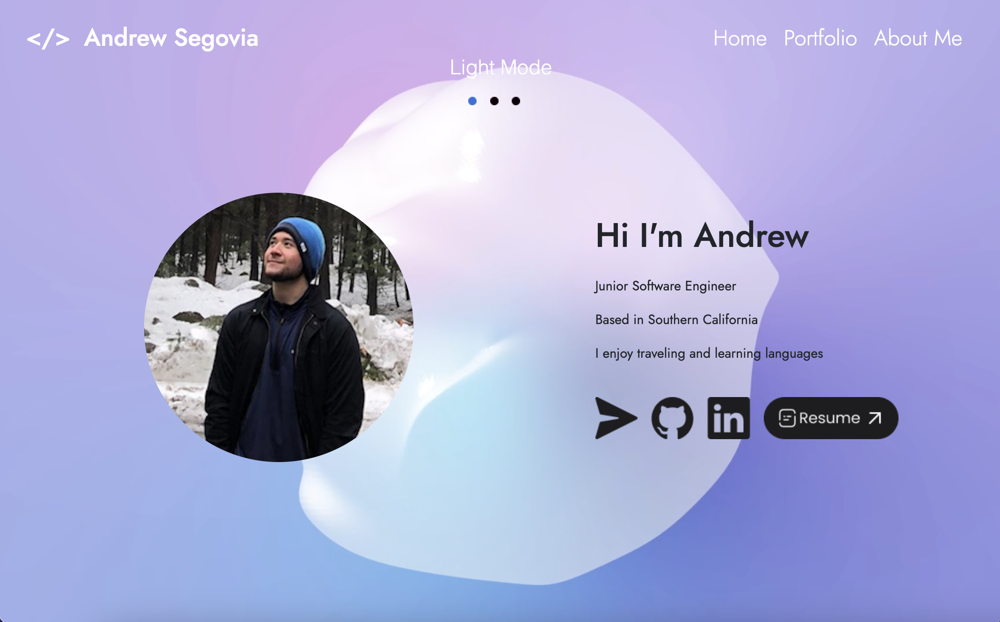
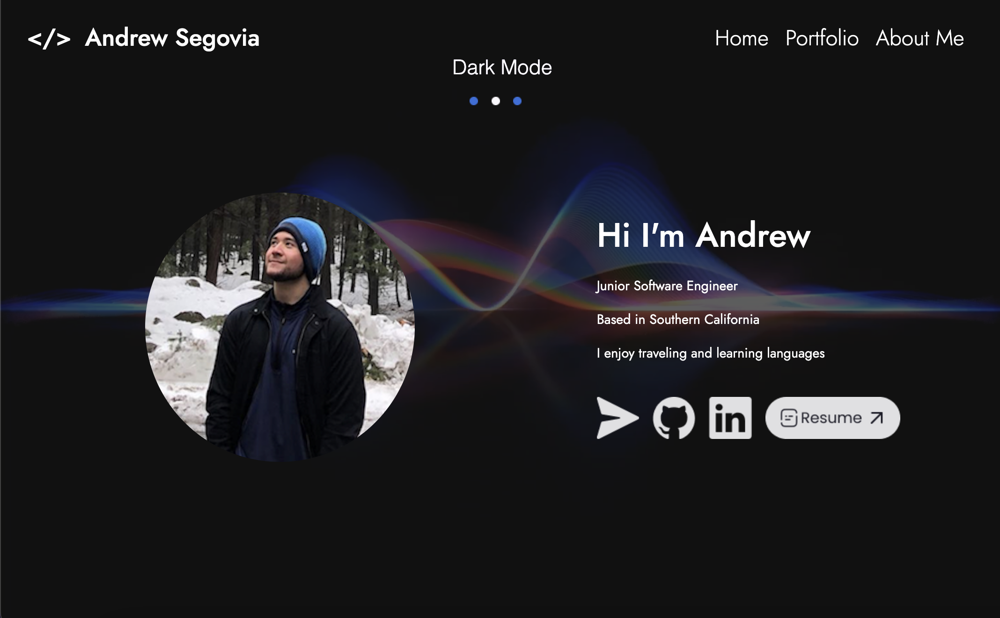

## Screenshots




## SetUp
Hi, my portfolio is a React + Vite project, here are the instructions on how to run my project locally or visit it with this livelink

First step is to clone the project:

```
git clone <repo url>
```


Now cd into the project on your terminal

```
cd andrews_portfolio
```


You'll want to install all the dependencies by running npm i on the terminal and open the project with your favorite IDE, my pick is visual studio code to see the code.

```
npm i
```


You'll want to run the following command to see the project on a browser window


```
npm run dev
```
